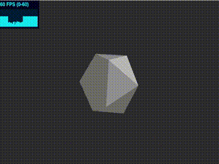

# Rebuild the ExplodingObjects
I forked the ExplodingObjects from `akella`.
https://github.com/akella/ExplodingObjects

However, it missed the build file. I can't modify the source code. So, I created the builder using the webpack.

## Install
    npm install

## Start Server
    npm start

## Build
    npm run build

